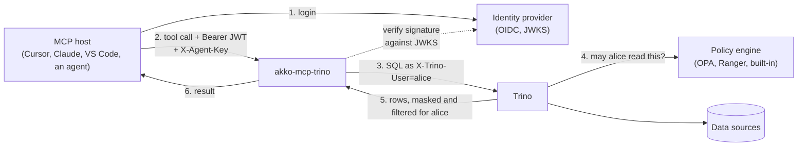
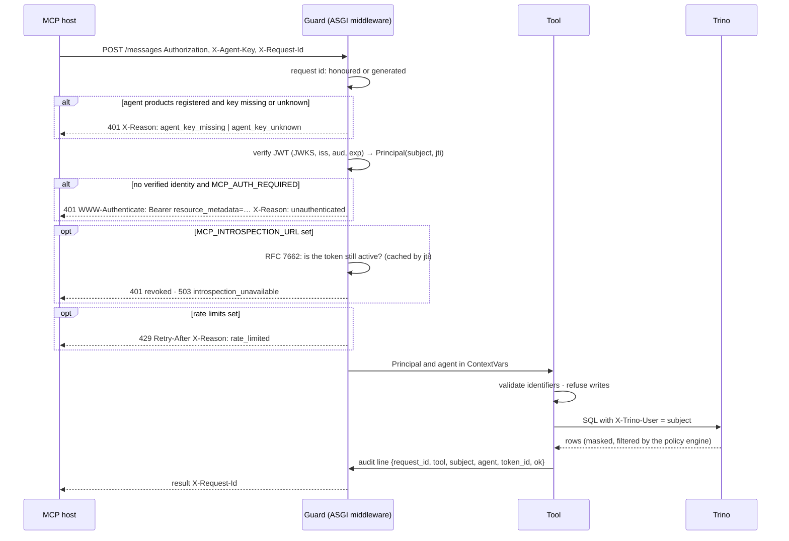

# akko-mcp-trino

A governed [MCP](https://modelcontextprotocol.io) server for Trino. Every tool
call an agent makes carries the identity of the person it acts for; the
decision on what that person may read is taken inside Trino, by the policy
engine you already run (OPA, Ranger, or Trino's own access control). The
server never reads on the user's behalf with a service account.

- Apache 2.0, Python 3.12, no product dependency.
- Five read tools. Writes are refused before they reach Trino.
- Works with any OIDC provider that publishes a JWKS.
- 172 tests, 100 % coverage, proven live against Trino behind Keycloak and OPA.

## Contents

1. [How it works](#how-it-works)
2. [Prerequisites](#prerequisites)
3. [Install and run](#install-and-run)
4. [Connect an MCP host](#connect-an-mcp-host)
5. [The tools](#the-tools)
6. [What happens on a request](#what-happens-on-a-request)
7. [Configuration](#configuration)
8. [Operations](#operations)
9. [Development](#development)
10. [Design notes](#design-notes)

## How it works



The user logs in to the identity provider the platform already has. The MCP
host sends the resulting JWT on every request. The server verifies it (signature
against the provider's JWKS, issuer, audience, expiry), reads the subject, and
runs the SQL in Trino **as that subject**. Trino asks its policy engine, applies
the user's catalog scope, row filters and column masks, and returns only what
the user could have read from any other client.

Two people asking the same question through the same server get two different
answers. That is the whole point.

## Prerequisites

| You need | Why | Notes |
|---|---|---|
| Python 3.12 or later | runtime | `pip` and a virtual environment |
| A reachable Trino coordinator | the engine | HTTP or HTTPS, any recent version (tested on 483) |
| Trino configured to trust `X-Trino-User` from this server | identity forwarding | the server connects as `TRINO_USER` and sets `X-Trino-User` to the caller; `TRINO_USER` must be allowed to impersonate in your access control (`impersonation` rules in file-based access control, or the equivalent in OPA / Ranger) |
| A policy engine deciding for Trino | the governance | OPA (`opa.policy.uri`), Ranger, or Trino file-based rules. Without one, every user reads everything |
| An OIDC provider with a JWKS endpoint | identity | Keycloak, Entra ID, Okta, Dex… Tokens must carry `iss`, `aud`, `exp`, and a subject (`preferred_username` or `sub`) |
| An MCP host that can send a bearer header | the client | Cursor, Claude Desktop, VS Code, or any client built on the `mcp` SDK |

Optional: a Prometheus to scrape `/metrics`, and — for revocation before
expiry — an RFC 7662 introspection endpoint with a client registered for this
server.

## Install and run

```bash
git clone https://github.com/AKKO-p/akko-mcp-trino.git
cd akko-mcp-trino
python -m venv .venv && source .venv/bin/activate
pip install -e .
```

Point it at your Trino and your identity provider, then serve:

```bash
export TRINO_HOST=trino.example.internal
export TRINO_PORT=8080
export TRINO_USER=mcp-trino            # the account that connects and impersonates
export TRINO_CATALOG=iceberg

export MCP_AUTH_ENABLED=true
export MCP_AUTH_REQUIRED=true          # refuse requests without a verified identity
export MCP_JWKS_URL=https://idp.example.com/realms/data/protocol/openid-connect/certs
export MCP_OIDC_ISSUER=https://idp.example.com/realms/data
export MCP_OIDC_AUDIENCE=data-platform

python -m core
```

You should see:

```
INFO:__main__:serving transport=sse port=3000 auth=True strict=True
```

Check it is alive and can reach Trino:

```bash
curl -s localhost:3001/health   # {"status":"ok"}       never touches Trino
curl -s localhost:3001/ready    # {"status":"ready"}    runs a bounded SELECT 1
curl -s localhost:3001/metrics  # Prometheus exposition
```

To try it on a laptop **without** an identity provider, leave
`MCP_AUTH_ENABLED` unset: every query then runs as `TRINO_USER`. Never run it
that way where the data matters.

### Container

```dockerfile
FROM python:3.12-slim
WORKDIR /app
COPY pyproject.toml README.md ./
COPY core ./core
RUN pip install --no-cache-dir .
EXPOSE 3000 3001
CMD ["python", "-m", "core"]
```

Build the image with your usual tooling and run it with the same environment
variables, publishing ports `3000` (MCP) and `3001` (health).

## Connect an MCP host

The host needs the user's access token from the identity provider. With
`MCP_RESOURCE_URL` set, hosts that implement OAuth discovery find the provider
on their own (see [Discovery](#discovery)); otherwise paste the token.

Cursor, Claude Desktop, VS Code (`mcp.json`):

```json
{
  "mcpServers": {
    "trino": {
      "url": "http://localhost:3000/sse",
      "headers": {
        "Authorization": "Bearer <the user's access token>",
        "X-Agent-Key": "<the key registered for this product, if any>"
      }
    }
  }
}
```

From Python, with the official SDK:

```python
import anyio
from mcp import ClientSession
from mcp.client.sse import sse_client

async def main(token: str):
    headers = {"Authorization": f"Bearer {token}", "X-Agent-Key": "my-agent-key"}
    async with sse_client("http://localhost:3000/sse", headers=headers) as (read, write):
        async with ClientSession(read, write) as session:
            await session.initialize()
            result = await session.call_tool("execute_query", {"sql": "SELECT 1"})
            print(result.content[0].text)

anyio.run(main, "<token>")
```

Set `MCP_TRANSPORT=streamable-http` to serve `/mcp` instead of `/sse`; the
guard is the same on both.

## The tools

| Tool | Arguments | Returns |
|---|---|---|
| `list_catalogs` | — | the catalogs the user can see |
| `list_schemas` | `catalog` | schemas in that catalog |
| `list_tables` | `catalog`, `schema` | tables in that schema |
| `describe_table` | `catalog`, `schema`, `table` | columns and types |
| `execute_query` | `sql` | `{"columns": [...], "rows": [...], "row_count": n}` |

Every identifier is validated (`[A-Za-z_][A-Za-z0-9_-]*`) before it is placed
in SQL. `execute_query` accepts any SQL Trino accepts, **as long as it is a
read**: the statement is parsed into an AST and refused if it is more than one
statement, or if an `INSERT`, `UPDATE`, `DELETE`, `MERGE`, `CREATE`, `DROP`,
`ALTER`, `GRANT`, `CALL` or `SET` appears anywhere in the tree — including
inside a CTE or a subquery. Results are capped at `TRINO_MAX_ROWS`.

Errors come back to the agent as `{"error": "..."}`; a permission refusal from
Trino is an ordinary error, not a crash.

## What happens on a request



Order matters. The agent key is checked before the token, so an unregistered
product never triggers a JWKS lookup. Quotas are counted after authentication,
so a forged token cannot consume the slot of the person it names. A refused
request consumes nothing.

## Configuration

Everything is read from the environment. Nothing is hardcoded.

### Trino

| Variable | Meaning | Default |
|---|---|---|
| `TRINO_HOST`, `TRINO_PORT` | the coordinator | `localhost`, `8080` |
| `TRINO_USER` | the account the server connects as; it impersonates the caller | `trino` |
| `TRINO_CATALOG` | default catalog | `system` |
| `TRINO_READ_ONLY` | refuse writes in `execute_query` | `true` |
| `TRINO_MAX_ROWS` | result cap | `100` |

### Identity

| Variable | Meaning | Default |
|---|---|---|
| `MCP_AUTH_ENABLED` | verify bearer tokens | `false` |
| `MCP_AUTH_REQUIRED` | refuse requests without a verified identity | `false` |
| `MCP_JWKS_URL` | the provider's JWKS endpoint | — (required when auth is enabled) |
| `MCP_OIDC_ISSUER`, `MCP_OIDC_AUDIENCE` | claims to enforce | — |
| `MCP_RESOURCE_URL` | public URL of this server; enables RFC 9728 discovery | — (off) |
| `MCP_AGENT_KEYS` | `name:key,name:key` — registered agent products; empty disables the check | — (off) |

Auth enabled without a JWKS URL refuses to start: an authentication layer that
cannot verify anything must not pretend to. A malformed `MCP_AGENT_KEYS` entry
refuses to start for the same reason.

### Guards

| Variable | Meaning | Default |
|---|---|---|
| `MCP_RATE_LIMIT_USER`, `MCP_RATE_LIMIT_AGENT` | requests per window per user and per agent product; `0` disables | `0`, `0` |
| `MCP_RATE_LIMIT_WINDOW_SECONDS` | the sliding window | `60` |
| `MCP_INTROSPECTION_URL` | RFC 7662 endpoint; enables the revocation check | — (off) |
| `MCP_INTROSPECTION_CLIENT_ID`, `MCP_INTROSPECTION_CLIENT_SECRET` | credentials the provider expects | — (required with the URL) |
| `MCP_INTROSPECTION_TTL_SECONDS` | how long a verdict is cached by `jti` | `30` |

### Serving

| Variable | Meaning | Default |
|---|---|---|
| `MCP_TRANSPORT` | `sse` or `streamable-http` | `sse` |
| `MCP_PORT`, `MCP_HEALTH_PORT` | listening ports | `3000`, `3001` |
| `MCP_SERVER_NAME` | name announced to hosts | `trino-mcp` |

## Operations

### Two principals

A workspace key from Cursor or Claude is not a user. When `MCP_AGENT_KEYS` is
set, every request must carry both:

| Principal | Header | Says | Enforced by |
|---|---|---|---|
| End user | `Authorization: Bearer <JWT>` | for whom the query runs | JWKS here, then the policy engine in Trino |
| Agent product | `X-Agent-Key: <key>` | which product is calling | the registry here, for quotas and audit |

### Discovery

With `MCP_RESOURCE_URL` set, the server publishes RFC 9728 metadata without a
token, and every `401` says where to go:

```bash
curl -s https://mcp.example.com/.well-known/oauth-protected-resource
# {"resource":"https://mcp.example.com","authorization_servers":["https://idp.example.com/realms/data"],"bearer_methods_supported":["header"]}

curl -si https://mcp.example.com/sse | grep -i -e www-auth -e x-reason
# WWW-Authenticate: Bearer realm="trino", resource_metadata="https://mcp.example.com/.well-known/oauth-protected-resource"
# X-Reason: unauthenticated
```

`authorization_servers` stays empty unless `MCP_OIDC_ISSUER` is set; the server
never guesses a provider.

### Refusals

Every refusal carries `X-Reason` and the request id, never the token:

| Status | `X-Reason` | Meaning |
|---|---|---|
| 401 | `agent_key_missing`, `agent_key_unknown` | products are registered and the key is absent or wrong |
| 401 | `unauthenticated` | no verified identity in strict mode |
| 401 | `revoked` | the provider says the token is no longer active |
| 429 | `rate_limited` | a window is full; `Retry-After` says when |
| 503 | `introspection_unavailable` | the provider could not be asked; the guard fails closed |

### Audit

Every response carries `X-Request-Id` — the one the edge sent, or one the
server generated. Every tool call writes one JSON line to the `mcp.audit`
logger keyed by that id:

```json
{"request_id":"edge-42","tool":"execute_query","subject":"alice","agent":"cursor","token_id":"jti-9","ok":false,"error":"Access Denied: Cannot select from columns [email] in table customers"}
```

`token_id` is the JWT's `jti`. The record has no field that could hold the
bearer. Join it with your gateway logs and Trino's query log on the request id.

### Revocation before expiry

A signature and an `exp` prove a token *was* valid. With `MCP_INTROSPECTION_URL`
set, the guard asks the provider (RFC 7662) and refuses a token whose `active`
is false. Verdicts are cached by `jti` for `MCP_INTROSPECTION_TTL_SECONDS`. If
the provider cannot answer, the request is refused with `503`, because
"unknown" is not "still valid".

Keycloak note: introspection is accepted only from a client that appears in the
token's `aud`. Register this server as its own confidential client and add it
to the audience mapper; the client that issued the token is not enough.

### Quotas

Two in-memory sliding windows, one per user subject and one per agent product.
Counters live in the process: with several replicas the quota is per replica.

### Health and metrics

`/health` on the health port never touches Trino, so a liveness probe cannot
kill the server because Trino is slow. `/ready` runs a bounded `SELECT 1`.
`/metrics` exposes `mcp_trino_queries_total`, `mcp_trino_query_errors_total`
and `mcp_trino_query_duration_seconds`.

## Development

```bash
pip install -e ".[dev]"
pytest                      # 172 tests; coverage below 100 % fails the run
bash lint-vendor-neutral.sh # fails if core/ imports anything product-specific
```

Every module in `core/` has one responsibility and its own test file:

| Module | Responsibility |
|---|---|
| `config.py` | read the environment, neutral defaults |
| `auth.py` | JWT verification against JWKS, `Principal` |
| `identity.py`, `agents.py` | user and agent product in ContextVars |
| `middleware.py` | the guard: key, token, revocation, quotas, discovery, request id |
| `discovery.py`, `ratelimit.py`, `revocation.py`, `audit.py` | one guard each |
| `sql_guard.py` | identifier validation, read-only decision on the AST |
| `tools.py`, `trino_client.py` | the five tools, the Trino connection |
| `server.py`, `app.py`, `__main__.py` | assembly, transport, entrypoint |

The README is tested too: every variable listed here is read by `config.py`,
and the defaults stated here are the defaults in the code.

## Design notes

**The guard is a pure ASGI middleware, not `BaseHTTPMiddleware`.** The latter
runs the downstream in a separate task and breaks ContextVar propagation: the
identity would never reach the tools. This was verified with concurrent
sessions of two users on both transports — zero crossed responses.

**Mounting is transport-independent.** One code path builds the transport app
and mounts the guard, whatever the transport. The guard once lived only on the
branch the default transport never took; a test now asserts it for both.

**Read-only is decided on the AST, anywhere in the tree.** A leading-keyword
check lets `WITH w AS (DELETE FROM t) SELECT 1` through. So did a root-node
check, until a live adversarial proof caught it. The guard now walks the whole
tree.

**Identity comes from the token, never from a header.** A caller sending
`X-Trino-User` or `X-Forwarded-User` changes nothing; the subject forwarded to
Trino is the verified JWT subject.

**The server does not decide access.** It carries identity. Putting policy in
the server would duplicate — and eventually contradict — what the engine
already enforces for every other client.

## License

Apache 2.0. See [LICENSE](LICENSE).
