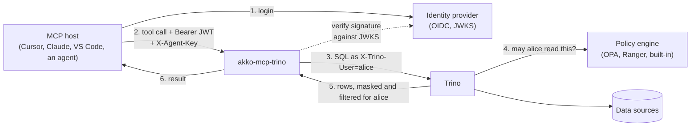
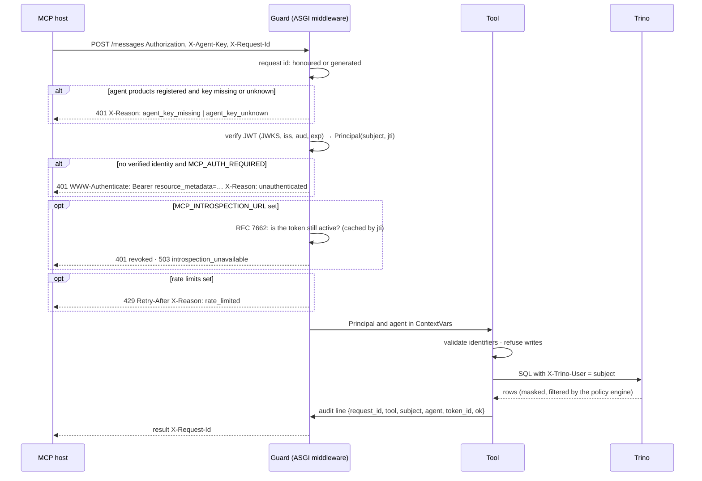

<p align="center">
  
  
  
  
  
  
  
  
  
  
</p>

# akko-mcp-trino

<!-- mcp-name: io.github.akko-p/akko-mcp-trino -->

**Give your AI agents access to Trino without giving them your data.**

akko-mcp-trino is a governed [MCP](https://modelcontextprotocol.io) server for
Trino. Every tool call an agent makes carries the identity of the person it
acts for; what that person may read is decided inside Trino, by the policy
engine you already run (OPA, Ranger, or Trino's own access control). The server
never reads on the user's behalf with a service account, and it never decides
access on its own.

## Why

Most MCP servers for SQL engines connect with one technical account. Every
agent, every user, every prompt then reads with the same broad rights, and the
only thing between a prompt injection and your customer table is the model's
good will.

This server takes the opposite stance. The agent brings the user's token. The
token becomes `X-Trino-User`. Trino applies that user's catalog scope, row
filters and column masks, exactly as it does for a BI tool or a notebook.

Same question, same server, two users:

```
$ python examples/agent.py "Give me three customer e-mails with their country"

as alice_admin     marie.martin0@gmail.com, FR   thomas.devries1@outlook.com, DE   léa.dubois2@proton.me, ES
as carol_analyst   ***@gmail.com, FR             ***@outlook.com, FR              ***@proton.me, FR
```

That run is real: a Mistral model driving the tools, on a Trino behind
Keycloak and OPA. The model did not know carol was restricted; it did not need
to.

## Highlights

- **Identity, end to end.** Verified JWT (JWKS, issuer, audience, expiry) → `X-Trino-User`, or the same JWT forwarded to Trino's own authenticator (`TRINO_IDENTITY_MODE=jwt`). No impersonation without a verified identity, no service credential in `jwt` mode.
- **Read-only by construction.** SQL is parsed into an AST and refused if a write appears anywhere in the tree, CTEs and subqueries included.
- **Two principals.** `X-Agent-Key` names the calling product (Cursor, Claude, your own agent) for quotas and audit; it is never a user.
- **Standard discovery.** RFC 9728 metadata and `WWW-Authenticate` on every `401`, so hosts know where to log in.
- **Quotas, revocation, audit.** Per-user and per-agent limits, optional RFC 7662 introspection, one JSON audit line per call keyed by `X-Request-Id` — never the token.
- **Any OIDC provider, any MCP host, any model.** Keycloak, Entra ID, Okta… Cursor, Claude Desktop, VS Code, the Python SDK… Mistral, or any OpenAI-compatible model through the example agent.
- **Small and proven.** 1 900 lines, 260 tests at 100 % line and branch coverage (including an in-process suite on the real SDK for all three transports), a product-neutral guard in CI, and eight live proofs (functional, adversarial, agent-driven, stdio, a real host, JWT passthrough on public https, context providers, OpenMetadata) on a real cluster.

## Documentation

- **Guide, prerequisites, configuration, examples, proofs:** [akko-ai.com/docs/akko-mcp-trino](https://akko-ai.com/docs/akko-mcp-trino/) (also [in English](https://akko-ai.com/en/docs/akko-mcp-trino/)) and [akko-ai.com/docs/exemples](https://akko-ai.com/docs/exemples/).
- **Why we built it, and what the proofs taught us:** [the AKKO blog](https://akko-ai.com/blog/) — start with [Your AI agents see exactly what the user is allowed to see](https://akko-ai.com/en/blog/ai-agents-governed-access-trino/).
- **Reference, in this repository:** this README, [`examples/`](examples/), [`CHANGELOG.md`](CHANGELOG.md), [`CONTRIBUTING.md`](CONTRIBUTING.md), [`SECURITY.md`](SECURITY.md).

## Contents

1. [How it works](#how-it-works)
2. [Compatibility](#compatibility)
3. [Prerequisites](#prerequisites)
4. [Install and run](#install-and-run)
5. [Connect an MCP host](#connect-an-mcp-host)
6. [Use it from an agent](#use-it-from-an-agent)
7. [The tools](#the-tools)
8. [What happens on a request](#what-happens-on-a-request)
9. [Configuration](#configuration)
10. [Operations](#operations)
11. [Development](#development)
12. [Design notes](#design-notes)
13. [Contributing](#contributing)
14. [About AKKO](#about-akko)

## How it works



The user logs in to the identity provider the platform already has. The MCP
host sends the resulting JWT on every request. The server verifies it (signature
against the provider's JWKS, issuer, audience, expiry), reads the subject, and
runs the SQL in Trino **as that subject**. Trino asks its policy engine, applies
the user's catalog scope, row filters and column masks, and returns only what
the user could have read from any other client.

Two people asking the same question through the same server get two different
answers. That is the whole point.

## Compatibility

| | Supported | Tested |
|---|---|---|
| Python | 3.12, 3.13 | 3.12, 3.13 (CI) |
| Trino | 351 and later (the `X-Trino-User` protocol header); http or https; password, or JWT passthrough | 483 behind OPA, in-cluster http with impersonation and public https with JWT passthrough |
| Policy engines | OPA (`trino-opa`), Ranger (Trino plugin), Trino file-based access control | OPA with row filters and column masks |
| Identity providers | any OIDC provider publishing a JWKS | Keycloak 26 |
| MCP | protocol 2025-06-18 via the official `mcp` SDK 1.30; transports `streamable-http`, `sse` and `stdio` | all three, official SDK client, in CI |
| MCP hosts | remote: anything that sends a bearer header (Cursor, Claude Desktop, VS Code, Le Chat connectors); local: any stdio host | Python SDK, the example agent |
| Models | any, the server never talks to a model | Mistral Small 3.2 through OpenRouter, driving the tools |

## Prerequisites

| You need | Why | Notes |
|---|---|---|
| Python 3.12 or later | runtime | `pip` and a virtual environment |
| A reachable Trino coordinator | the engine | HTTP or HTTPS, any recent version (tested on 483) |
| Trino configured for one of the two identity modes | identity forwarding | `impersonate`: `TRINO_USER` allowed to impersonate in your access control (`impersonation` rules, or the equivalent in OPA / Ranger); `jwt`: Trino's `OAUTH2`/`JWT` authenticator pointed at your identity provider |
| A policy engine deciding for Trino | the governance | OPA (`opa.policy.uri`), Ranger, or Trino file-based rules. Without one, every user reads everything |
| An OIDC provider with a JWKS endpoint | identity | Keycloak, Entra ID, Okta, Dex… Tokens must carry `iss`, `aud`, `exp`, and a subject (`preferred_username` or `sub`) |
| An MCP host that can send a bearer header | the client | Cursor, Claude Desktop, VS Code, or any client built on the `mcp` SDK |

Optional: a Prometheus to scrape `/metrics`, and — for revocation before
expiry — an RFC 7662 introspection endpoint with a client registered for this
server.

## Install and run

```bash
pip install akko-mcp-trino        # or: pipx install akko-mcp-trino
uvx akko-mcp-trino --version      # run it without installing, the way most MCP hosts do
docker run --rm ghcr.io/akko-p/akko-mcp-trino --version
```

The package is a plain PyPI package, so `uv`, `pipx`, `poetry` and `pip` all work; no separate distribution is needed for `uv`. A conda-forge recipe is not published: MCP hosts do not use conda, and every dependency is pure Python. Tell us in an issue if a conda-only environment needs it.

Or from source:

```bash
git clone https://github.com/AKKO-p/akko-mcp-trino.git
cd akko-mcp-trino
python -m venv .venv && source .venv/bin/activate
pip install -e .
```

The package installs a Python module (`akko_mcp_trino`) and a command
(`akko-mcp-trino`); `python -m akko_mcp_trino` is the same entrypoint.

Point it at your Trino and your identity provider, then serve:

```bash
export TRINO_HOST=trino.example.internal
export TRINO_PORT=8080
export TRINO_USER=mcp-trino            # the account that connects and impersonates
export TRINO_CATALOG=iceberg

export MCP_AUTH_ENABLED=true
export MCP_AUTH_REQUIRED=true          # refuse requests without a verified identity
export MCP_JWKS_URL=https://idp.example.com/realms/data/protocol/openid-connect/certs
export MCP_OIDC_ISSUER=https://idp.example.com/realms/data
export MCP_OIDC_AUDIENCE=data-platform

python -m akko_mcp_trino
```

Before serving, `akko-mcp-trino --check` prints the effective configuration
(never a secret) and exits with 2 if something would refuse to start. Then:

```
INFO:__main__:serving transport=streamable-http port=3000 auth=True strict=True
```

Check it is alive and can reach Trino:

```bash
curl -s localhost:3001/health   # {"status":"ok"}       never touches Trino
curl -s localhost:3001/ready    # {"status":"ready"}    runs a bounded SELECT 1
curl -s localhost:3001/metrics  # Prometheus exposition
```

To try it on a laptop **without** an identity provider, leave
`MCP_AUTH_ENABLED` unset: every query then runs as `TRINO_USER`. Never run it
that way where the data matters.

### Container

A [Dockerfile](Dockerfile) ships with the repository (non-root, health check,
OCI labels); releases publish the image to `ghcr.io/akko-p/akko-mcp-trino`.
Run it with the same environment variables, publishing ports `3000` (MCP) and
`3001` (health).

## Connect an MCP host

The host needs the user's access token from the identity provider. With
`MCP_RESOURCE_URL` set, hosts that implement OAuth discovery find the provider
on their own (see [Discovery](#discovery)); otherwise paste the token.

Cursor, Claude Desktop, VS Code (`mcp.json`):

```json
{
  "mcpServers": {
    "trino": {
      "url": "http://localhost:3000/mcp",
      "headers": {
        "Authorization": "Bearer <the user's access token>",
        "X-Agent-Key": "<the key registered for this product, if any>"
      }
    }
  }
}
```

From Python, with the official SDK:

```python
import anyio
from mcp import ClientSession
from mcp.client.streamable_http import streamablehttp_client

async def main(token: str):
    headers = {"Authorization": f"Bearer {token}", "X-Agent-Key": "my-agent-key"}
    async with streamablehttp_client("http://localhost:3000/mcp", headers=headers) as (read, write, _):
        async with ClientSession(read, write) as session:
            await session.initialize()
            result = await session.call_tool("execute_query", {"sql": "SELECT 1"})
            print(result.content[0].text)

anyio.run(main, "<token>")
```

`streamable-http` (`/mcp`) is the default and what current hosts expect. Set
`MCP_TRANSPORT=sse` for older hosts (`/sse`); the guard is the same on both.

### Local hosts over stdio

Claude Desktop, Cursor and Mistral Vibe can launch the server themselves.
There is no request then, so the identity comes from the environment: the
user's own access token, verified exactly like a bearer header would be, and
bound to the process. Strict mode refuses to start without it.

```json
{
  "mcpServers": {
    "trino": {
      "command": "uvx",
      "args": ["akko-mcp-trino"],
      "env": {
        "MCP_TRANSPORT": "stdio",
        "TRINO_HOST": "trino.example.internal",
        "MCP_AUTH_ENABLED": "true", "MCP_AUTH_REQUIRED": "true",
        "MCP_JWKS_URL": "https://idp.example.com/realms/data/protocol/openid-connect/certs",
        "MCP_OIDC_ISSUER": "https://idp.example.com/realms/data",
        "MCP_OIDC_AUDIENCE": "data-platform",
        "MCP_USER_TOKEN": "<the user's access token>"
      }
    }
  }
}
```

`uvx akko-mcp-trino` runs the published package without installing anything.

## Use it from an agent

[`examples/agent.py`](examples/agent.py) is a complete agent in eighty lines:
any OpenAI-compatible model (Mistral on La Plateforme, through OpenRouter or
LiteLLM; or any other provider), the MCP tools, the user's token. The model
never sees the token; the server receives it on every tool call.

```bash
pip install akko-mcp-trino openai
export LLM_BASE_URL=https://api.mistral.ai/v1
export LLM_API_KEY=...
export LLM_MODEL=mistral-small-latest
export MCP_URL=http://localhost:3000/mcp
export USER_TOKEN=<the user's access token>
python examples/agent.py "Which catalogs can I see, and what is in them?"
```

Run it twice with two users' tokens and compare. The
[examples](examples/README.md) folder has the details.

## The tools

| Tool | Arguments | Returns |
|---|---|---|
| `list_catalogs` | — | the catalogs the user can see |
| `list_schemas` | `catalog` | schemas in that catalog |
| `list_tables` | `catalog`, `schema` | tables and views in that schema |
| `describe_table` | `catalog`, `schema`, `table`, `sample_rows` (0–20) | columns, types, comments; a governed sample when asked |
| `search_columns` | `pattern` (SQL LIKE), `catalog` (optional) | tables having a column matching the pattern |
| `profile_table` | `catalog`, `schema`, `table` | `SHOW STATS`: row count, distinct values, null fraction, ranges |
| `explain_table` | `catalog`, `schema`, `table` | what the table means: description, owner, tier, grain, joins, tags (from the context providers) |
| `explain_query` | `sql` | Trino's plan for a read-only statement, without running it |
| `execute_query` | `sql` | `{"columns": [...], "rows": [...], "row_count": n}` |

Every tool runs in Trino under the caller's identity, discovery included:
metadata is data, and a user who may not read a schema does not list it
either. Every description is written for a model: what the tool returns,
and that a masked value or a missing row is the access policy, not an error
to retry.

Every identifier is validated (`[A-Za-z_][A-Za-z0-9_-]*`) before it is placed
in SQL. `execute_query` accepts any SQL Trino accepts, **as long as it is a
read**: the statement is parsed into an AST and refused if it is more than one
statement, or if an `INSERT`, `UPDATE`, `DELETE`, `MERGE`, `CREATE`, `DROP`,
`ALTER`, `GRANT`, `CALL` or `SET` appears anywhere in the tree — including
inside a CTE, a subquery, or the statement an `EXPLAIN` explains. `EXPLAIN
ANALYZE` is refused: it executes what it explains. Results are capped at `TRINO_MAX_ROWS`.

Errors come back to the agent as `{"error": "..."}`; a permission refusal from
Trino is an ordinary error, not a crash.

## Context: what Trino cannot say

`DESCRIBE` gives columns and types. It does not say what `segment` means, who
owns the table, whether it is trustworthy, which column joins it to another,
or that `email` is personal data. A model without that guesses, and guesses
wrong.

The server knows no catalogue. It knows an interface, `ContextProvider`, and a
chain of providers fills it, in priority order:

| Provider | Where the knowledge comes from | Needs |
|---|---|---|
| `trino-comments` | the `COMMENT ON` Trino already carries, read under the caller's identity | nothing |
| `file` | a versioned JSON document kept with your code: description, owner, tier, grain, joins, tags, column classification and values | `MCP_CONTEXT_FILE` |
| `openmetadata` | descriptions, owners, tier, tags, primary key as grain, foreign keys as joins, column classifications such as `PII.Sensitive`, from [OpenMetadata](providers/openmetadata/) | `pip install akko-mcp-trino-openmetadata`, `OPENMETADATA_URL`, `OPENMETADATA_TOKEN`, `OPENMETADATA_SERVICE` |
| your catalogue | DataHub, Atlas, Collibra… a package that implements the same two methods and registers itself under the entry-point group `akko_mcp_trino.context`; or a provider passed to `build_server(context=...)` | that package |

```json
{"version": 1, "tables": {
  "core_postgres.clients.customers": {
    "description": "One row per customer", "owner": "Customer data team", "tier": "gold",
    "grain": ["customer_id"],
    "joins": [{"columns": ["customer_id"], "target": "core_postgres.clients.accounts", "target_columns": ["customer_id"]}],
    "tags": ["pii"],
    "columns": {"email": {"description": "Contact address", "classification": ["PII"]},
                "segment": {"description": "Commercial segment", "values": ["retail", "business", "premium"]}}}}}
```

With `MCP_CONTEXT_PROVIDERS=file,trino-comments`, `describe_table` returns the
columns **and** a `table` block (description, owner, tier, grain, joins, tags)
and a `column_context` block; `explain_table` answers from the same knowledge,
or `{"known": false}`. The file wins where both speak. A provider describes;
it never decides: knowing a column is PII changes nothing about the mask,
which the engine applies. A provider that fails never hides the columns.

## What happens on a request



Order matters. The agent key is checked before the token, so an unregistered
product never triggers a JWKS lookup. Quotas are counted after authentication,
so a forged token cannot consume the slot of the person it names. A refused
request consumes nothing.

## Configuration

Everything is read from the environment. Nothing is hardcoded.

### Trino

| Variable | Meaning | Default |
|---|---|---|
| `TRINO_HOST`, `TRINO_PORT` | the coordinator | `localhost`, `8080` |
| `TRINO_USER` | the account the server connects as; it impersonates the caller | `trino` |
| `TRINO_CATALOG` | default catalog | `system` |
| `TRINO_READ_ONLY` | refuse writes in `execute_query` | `true` |
| `TRINO_MAX_ROWS` | result cap | `100` |
| `TRINO_HTTP_SCHEME` | `http` or `https` | `http` |
| `TRINO_PASSWORD` | password of `TRINO_USER` (Basic auth); refused over plain http | — |
| `TRINO_VERIFY` | TLS verification: `true`, `false`, or a path to a CA bundle | `true` |
| `TRINO_REQUEST_TIMEOUT_SECONDS` | per-request timeout on the Trino client | `30` |
| `TRINO_IDENTITY_MODE` | `impersonate` (connect as `TRINO_USER`, set `X-Trino-User` to the caller) or `jwt` (send the caller's verified bearer to Trino; needs https, no service password) | `impersonate` |

### Two ways to reach Trino as the user

| Mode | How | What Trino needs | When |
|---|---|---|---|
| `impersonate` (default) | the server authenticates as `TRINO_USER` (Basic over https when `TRINO_PASSWORD` is set) and sets `X-Trino-User` to the verified caller | an impersonation rule allowing `TRINO_USER` → users (file-based access control, OPA or Ranger) | Trino authenticates with passwords, certificates or Kerberos |
| `jwt` | the caller's own bearer, already verified by the guard, is sent to Trino as its JWT; the server holds no credential at all | the `OAUTH2` or `JWT` authenticator pointed at the same issuer | Trino already trusts your identity provider — the cleanest setup, proven live on a Trino behind Keycloak |

Both fail closed: a password never travels over plain http, and the `jwt` mode
never falls back to the service account when a request has no bearer.

### Identity

| Variable | Meaning | Default |
|---|---|---|
| `MCP_AUTH_ENABLED` | verify bearer tokens | `false` |
| `MCP_AUTH_REQUIRED` | refuse requests without a verified identity | `false` |
| `MCP_JWKS_URL` | the provider's JWKS endpoint | — (required when auth is enabled) |
| `MCP_OIDC_ISSUER`, `MCP_OIDC_AUDIENCE` | claims to enforce | — |
| `MCP_JWT_LEEWAY_SECONDS` | tolerance on `exp`/`nbf`/`iat` for clock drift between the issuer and this server | `30` |
| `MCP_RESOURCE_URL` | public URL of this server; enables RFC 9728 discovery | — (off) |
| `MCP_AGENT_KEYS` | `name:key,name:key` — registered agent products; empty disables the check | — (off) |

Auth enabled without a JWKS URL refuses to start: an authentication layer that
cannot verify anything must not pretend to. A malformed `MCP_AGENT_KEYS` entry
refuses to start for the same reason.

### Guards

| Variable | Meaning | Default |
|---|---|---|
| `MCP_RATE_LIMIT_USER`, `MCP_RATE_LIMIT_AGENT` | requests per window per user and per agent product; `0` disables | `0`, `0` |
| `MCP_RATE_LIMIT_WINDOW_SECONDS` | the sliding window | `60` |
| `MCP_INTROSPECTION_URL` | RFC 7662 endpoint; enables the revocation check | — (off) |
| `MCP_INTROSPECTION_CLIENT_ID`, `MCP_INTROSPECTION_CLIENT_SECRET` | credentials the provider expects | — (required with the URL) |
| `MCP_INTROSPECTION_TTL_SECONDS` | how long a verdict is cached by `jti` | `30` |

### Context providers

| Variable | Meaning | Default |
|---|---|---|
| `MCP_CONTEXT_PROVIDERS` | comma-separated, priority order: `trino-comments`, `file`, `none` | — (none) |
| `MCP_CONTEXT_FILE` | the JSON document for `file` (format below) | — |
| `MCP_CONTEXT_TTL_SECONDS` | how long an answer is cached | `60` |

### Serving

| Variable | Meaning | Default |
|---|---|---|
| `MCP_TRANSPORT` | `streamable-http`, `sse` or `stdio` | `streamable-http` |
| `MCP_PORT`, `MCP_HEALTH_PORT` | listening ports | `3000`, `3001` |
| `MCP_SERVER_NAME` | name announced to hosts | `trino-mcp` |
| `MCP_USER_TOKEN` | stdio only: the user's access token, verified like a bearer header | — (required in strict mode) |

## Operations

### Two principals

A workspace key from Cursor or Claude is not a user. When `MCP_AGENT_KEYS` is
set, every request must carry both:

| Principal | Header | Says | Enforced by |
|---|---|---|---|
| End user | `Authorization: Bearer <JWT>` | for whom the query runs | JWKS here, then the policy engine in Trino |
| Agent product | `X-Agent-Key: <key>` | which product is calling | the registry here, for quotas and audit |

### Discovery

With `MCP_RESOURCE_URL` set, the server publishes RFC 9728 metadata without a
token, and every `401` says where to go:

```bash
curl -s https://mcp.example.com/.well-known/oauth-protected-resource
# {"resource":"https://mcp.example.com","authorization_servers":["https://idp.example.com/realms/data"],"bearer_methods_supported":["header"]}

curl -si https://mcp.example.com/mcp | grep -i -e www-auth -e x-reason
# WWW-Authenticate: Bearer realm="trino-mcp", resource_metadata="https://mcp.example.com/.well-known/oauth-protected-resource"
# X-Reason: unauthenticated
```

`authorization_servers` stays empty unless `MCP_OIDC_ISSUER` is set; the server
never guesses a provider.

### Refusals

Every refusal carries `X-Reason` and the request id, never the token:

| Status | `X-Reason` | Meaning |
|---|---|---|
| 401 | `agent_key_missing`, `agent_key_unknown` | products are registered and the key is absent or wrong |
| 401 | `unauthenticated` | no verified identity in strict mode |
| 401 | `revoked` | the provider says the token is no longer active |
| 429 | `rate_limited` | a window is full; `Retry-After` says when |
| 503 | `introspection_unavailable` | the provider could not be asked; the guard fails closed |

### Audit

Every response carries `X-Request-Id` — the one the edge sent, or one the
server generated. Every tool call writes one JSON line to the `mcp.audit`
logger keyed by that id:

```json
{"request_id":"edge-42","tool":"execute_query","subject":"alice","agent":"cursor","token_id":"jti-9","ok":false,"error":"Access Denied: Cannot select from columns [email] in table customers"}
```

`token_id` is the JWT's `jti`. The record has no field that could hold the
bearer. Join it with your gateway logs and Trino's query log on the request id.

### Revocation before expiry

A signature and an `exp` prove a token *was* valid. With `MCP_INTROSPECTION_URL`
set, the guard asks the provider (RFC 7662) and refuses a token whose `active`
is false. Verdicts are cached by `jti` for `MCP_INTROSPECTION_TTL_SECONDS`. If
the provider cannot answer, the request is refused with `503`, because
"unknown" is not "still valid".

Keycloak note: introspection is accepted only from a client that appears in the
token's `aud`. Register this server as its own confidential client and add it
to the audience mapper; the client that issued the token is not enough.

### Quotas

Two in-memory sliding windows, one per user subject and one per agent product.
Counters live in the process: with several replicas the quota is per replica.

### Health and metrics

`/health` on the health port never touches Trino, so a liveness probe cannot
kill the server because Trino is slow. `/ready` runs a bounded `SELECT 1`.
`/metrics` exposes `mcp_trino_queries_total`, `mcp_trino_query_errors_total`
and `mcp_trino_query_duration_seconds`.

## Development

```bash
pip install -e ".[dev]"
ruff check akko_mcp_trino tests examples && ruff format akko_mcp_trino tests examples
ruff check akko_mcp_trino --select D100,D101,D102,D103,D105,D107   # every public name documented
mypy akko_mcp_trino           # the package ships py.typed and type-checks clean
pip-audit                     # no known vulnerability in the dependency tree
bash lint-vendor-neutral.sh   # fails if the package imports anything product-specific
pytest                        # 260 tests; line or branch coverage below 100 % fails the run
python -m build && twine check dist/*
akko-mcp-trino --check        # effective configuration, no secrets, exit 2 if it would not start
```

CI runs the same steps on Python 3.12 and 3.13, then builds the container
image; CodeQL scans every push and Dependabot opens weekly update pull
requests for pip, Actions and the base image. A `v*` tag publishes the package to PyPI (trusted publishing) and the
image to GHCR — see [release.yml](.github/workflows/release.yml).

Every module in `akko_mcp_trino/` has one responsibility and its own test file:

| Module | Responsibility |
|---|---|
| `config.py` | read the environment, neutral defaults |
| `auth.py` | JWT verification against JWKS, `Principal` |
| `identity.py`, `agents.py` | user and agent product in ContextVars |
| `middleware.py` | the guard: key, token, revocation, quotas, discovery, request id |
| `discovery.py`, `ratelimit.py`, `revocation.py`, `audit.py` | one guard each |
| `sql_guard.py` | identifier validation, read-only decision on the AST |
| `tools.py`, `trino_client.py` | the eight tools, the Trino connection |
| `server.py`, `app.py`, `__main__.py` | assembly, transport, entrypoint |

The README is tested too: every variable listed here is read by `config.py`,
and the defaults stated here are the defaults in the code.

## Design notes

**The guard is a pure ASGI middleware, not `BaseHTTPMiddleware`.** The latter
runs the downstream in a separate task and breaks ContextVar propagation: the
identity would never reach the tools. This was verified with concurrent
sessions of two users on both transports — zero crossed responses.

**Mounting is transport-independent.** One code path builds the transport app
and mounts the guard, whatever the transport. The guard once lived only on the
branch the default transport never took; a test now asserts it for both.

**Every tool carries the identity, not only `execute_query`.** Version 0.1
ran discovery as the service account; a restricted user could list what the
engine would hide from them. Fixed in 0.2 with a test that walks every tool.

**Read-only is decided on the AST, anywhere in the tree.** A leading-keyword
check lets `WITH w AS (DELETE FROM t) SELECT 1` through. So did a root-node
check, until a live adversarial proof caught it. The guard now walks the whole
tree.

**Identity comes from the token, never from a header.** A caller sending
`X-Trino-User` or `X-Forwarded-User` changes nothing; the subject forwarded to
Trino is the verified JWT subject.

**The server does not decide access.** It carries identity. Putting policy in
the server would duplicate — and eventually contradict — what the engine
already enforces for every other client.

## Contributing

Contributions are welcome — see [CONTRIBUTING.md](CONTRIBUTING.md) for the
ground rules (tests first, 100 % coverage, product-neutral, fail closed) and
[SECURITY.md](SECURITY.md) for reporting a vulnerability privately.
Changes are tracked in [CHANGELOG.md](CHANGELOG.md).

## About AKKO

akko-mcp-trino is built and maintained by [AKKO](https://akko-ai.com), a
French company working on governed access for AI agents to enterprise data,
in place, on the engines and identity providers customers already run. This
server is the first brick of that work, extracted from the AKKO platform where
it has run in production since July 2026 and released so that anyone running
Trino can put identity in front of their agents today.

If you run Trino behind Ranger or OPA and want a hand wiring this up, or want
to see the rest of the platform, [say hello](https://akko-ai.com).

**Maintained by:** AKKO ([contact@akko-ai.com](mailto:contact@akko-ai.com)) ·
**Issues:** [github.com/AKKO-p/akko-mcp-trino/issues](https://github.com/AKKO-p/akko-mcp-trino/issues)

## License

Apache 2.0. See [LICENSE](LICENSE).
